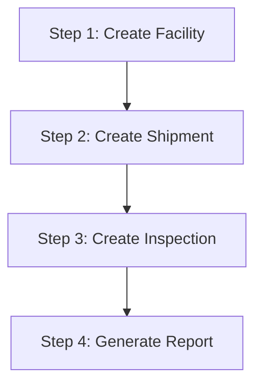
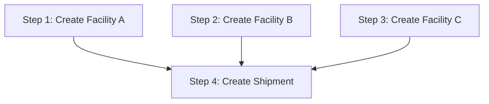

# Execution Agent Guide

The Execution Agent is a powerful orchestration system that executes plans created by the Planner Agent. It provides advanced features like dependency resolution, parallel execution, retry logic, and rollback capabilities.

## Overview

The Execution Agent consists of several key components:

- **ExecutionAgent**: Main orchestrator that manages the execution flow
- **ExecutionOrchestrator**: Handles dependency resolution and parallel execution
- **RetryHandler**: Manages retry logic with exponential backoff
- **RollbackHandler**: Generates and executes rollback plans
- **ExecutionStorage**: Persists execution data to MongoDB

## Quick Start

### 1. Create a Plan

First, create a plan using the Planner Agent:

```graphql
mutation {
  createPlan(query: "List all shipments and create a facility") {
    requestId
    plan {
      steps {
        tool
        params
        dependsOn
        parallel
        description
      }
    }
    status
  }
}
```

### 2. Execute the Plan

Execute the plan using the Execution Agent:

```graphql
mutation {
  executePlan(planRequestId: "your-plan-request-id") {
    executionId
    status
    totalSteps
    completedSteps
    failedSteps
    results {
      stepIndex
      tool
      status
      result
      error
      retryCount
    }
  }
}
```

### 3. Monitor Execution

Check the execution status:

```graphql
query {
  getExecution(executionId: "your-execution-id") {
    executionId
    status
    startedAt
    completedAt
    totalSteps
    completedSteps
    failedSteps
    results {
      stepIndex
      tool
      status
      result
      error
      retryCount
    }
  }
}
```

## Configuration Options

The Execution Agent supports various configuration options:

```graphql
mutation {
  executePlan(
    planRequestId: "your-plan-request-id"
    config: {
      maxRetries: 3
      retryDelayMs: 1000
      enableRollback: true
      continueOnError: false
      parallelExecutionLimit: 5
    }
  ) {
    executionId
    status
  }
}
```

### Configuration Parameters

- **maxRetries**: Maximum number of retry attempts (default: 3)
- **retryDelayMs**: Base delay between retries in milliseconds (default: 1000)
- **enableRollback**: Whether to enable automatic rollback on failure (default: true)
- **continueOnError**: Whether to continue execution when a step fails (default: false)
- **parallelExecutionLimit**: Maximum number of parallel steps (default: 5)

## Execution Flow

### 1. Sequential Execution

Steps are executed in dependency order:



### 2. Parallel Execution

Steps with `parallel: true` and no dependencies can run simultaneously:



### 3. Dependency Resolution

The orchestrator automatically resolves dependencies:

- Steps with no dependencies can start immediately
- Steps with dependencies wait for all dependencies to complete
- Parallel steps execute simultaneously (up to the limit)
- Sequential steps execute one at a time

## Error Handling

### Retry Logic

The Execution Agent includes sophisticated retry logic:

- **Exponential Backoff**: Delays increase exponentially between retries
- **Jitter**: Random variation prevents thundering herd problems
- **Retryable Error Detection**: Only retries on transient errors
- **Custom Retry Delays**: Supports custom delays from error responses

#### Retryable Errors

The system automatically retries on:
- Network timeouts
- Connection errors (ECONNRESET, ENOTFOUND, etc.)
- Server errors (5xx HTTP status codes)
- Rate limiting (429 HTTP status code)
- Temporary unavailability

#### Non-Retryable Errors

The system does not retry on:
- Validation errors (4xx HTTP status codes)
- Authorization errors
- Syntax errors
- Programming errors (TypeError, ReferenceError)

### Rollback

When execution fails and `enableRollback: true`, the system:

1. Identifies completed steps
2. Generates inverse operations (create → delete, update → restore)
3. Executes rollback in reverse order
4. Marks execution as `ROLLED_BACK`

#### Supported Rollback Operations

- **Create Operations**: Automatically deleted
- **Update Operations**: Restored to original values
- **Delete Operations**: Recreated with original data

## Advanced Features

### Parallel Execution

Execute multiple independent steps simultaneously:

```graphql
mutation {
  executePlan(
    planRequestId: "parallel-plan-id"
    config: {
      parallelExecutionLimit: 10
    }
  ) {
    executionId
    status
    results {
      stepIndex
      tool
      status
      startedAt
      completedAt
    }
  }
}
```

### Continue on Error

Allow execution to continue even when steps fail:

```graphql
mutation {
  executePlan(
    planRequestId: "resilient-plan-id"
    config: {
      continueOnError: true
    }
  ) {
    executionId
    status
    completedSteps
    failedSteps
  }
}
```

### Custom Retry Configuration

Fine-tune retry behavior:

```graphql
mutation {
  executePlan(
    planRequestId: "retry-plan-id"
    config: {
      maxRetries: 5
      retryDelayMs: 2000
    }
  ) {
    executionId
    status
  }
}
```

## Monitoring and Management

### Get Execution Status

```graphql
query {
  getExecution(executionId: "exec-123") {
    executionId
    status
    startedAt
    completedAt
    totalSteps
    completedSteps
    failedSteps
    results {
      stepIndex
      tool
      status
      result
      error
      retryCount
      startedAt
      completedAt
    }
  }
}
```

### List Executions by Plan

```graphql
query {
  getExecutionsByPlanId(planRequestId: "plan-123") {
    executionId
    status
    startedAt
    completedAt
    totalSteps
    completedSteps
    failedSteps
  }
}
```

### Get Recent Executions

```graphql
query {
  getRecentExecutions(limit: 20) {
    executionId
    planRequestId
    status
    startedAt
    completedAt
    totalSteps
    completedSteps
    failedSteps
  }
}
```

### Execution Statistics

```graphql
query {
  getExecutionStatistics {
    total
    byStatus {
      PENDING
      RUNNING
      COMPLETED
      FAILED
      ROLLED_BACK
    }
    averageExecutionTime
    successRate
    averageStepsPerExecution
  }
}
```

## Management Operations

### Cancel Execution

Cancel a running execution:

```graphql
mutation {
  cancelExecution(executionId: "exec-123")
}
```

### Retry Failed Execution

Retry a failed execution:

```graphql
mutation {
  retryExecution(executionId: "exec-123") {
    executionId
    status
  }
}
```

## Status Codes

### Execution Status

- **PENDING**: Execution created but not started
- **RUNNING**: Execution in progress
- **COMPLETED**: All steps completed successfully
- **FAILED**: Execution failed (some steps failed)
- **ROLLED_BACK**: Execution failed and was rolled back

### Step Status

- **PENDING**: Step waiting to be executed
- **RUNNING**: Step currently executing
- **COMPLETED**: Step completed successfully
- **FAILED**: Step failed after all retries
- **SKIPPED**: Step skipped due to dependencies

## Best Practices

### 1. Plan Design

- Design plans with clear dependencies
- Use parallel execution for independent operations
- Keep steps focused and atomic
- Include proper error handling

### 2. Configuration

- Set appropriate retry limits based on your tools
- Use parallel execution for independent steps
- Enable rollback for critical operations
- Consider using `continueOnError` for non-critical failures

### 3. Monitoring

- Monitor execution statistics regularly
- Set up alerts for failed executions
- Track execution times and success rates
- Review rollback patterns

### 4. Error Handling

- Design plans to handle expected failures
- Use appropriate retry configurations
- Test rollback scenarios
- Monitor error patterns

## Example Workflows

### 1. Data Migration

```graphql
mutation {
  executePlan(
    planRequestId: "migration-plan-id"
    config: {
      maxRetries: 5
      retryDelayMs: 2000
      enableRollback: true
      continueOnError: false
      parallelExecutionLimit: 3
    }
  ) {
    executionId
    status
  }
}
```

### 2. Bulk Operations

```graphql
mutation {
  executePlan(
    planRequestId: "bulk-operations-plan-id"
    config: {
      maxRetries: 3
      retryDelayMs: 1000
      enableRollback: false
      continueOnError: true
      parallelExecutionLimit: 10
    }
  ) {
    executionId
    status
  }
}
```

### 3. Critical Operations

```graphql
mutation {
  executePlan(
    planRequestId: "critical-plan-id"
    config: {
      maxRetries: 10
      retryDelayMs: 5000
      enableRollback: true
      continueOnError: false
      parallelExecutionLimit: 1
    }
  ) {
    executionId
    status
  }
}
```

## Troubleshooting

### Common Issues

1. **Execution Stuck**: Check for circular dependencies
2. **High Failure Rate**: Review retry configuration
3. **Slow Execution**: Consider parallel execution
4. **Rollback Failures**: Check inverse operation support

### Debug Information

Use the execution details to debug issues:

```graphql
query {
  getExecution(executionId: "exec-123") {
    results {
      stepIndex
      tool
      status
      error
      retryCount
      startedAt
      completedAt
    }
  }
}
```

### Performance Optimization

- Use parallel execution for independent steps
- Optimize retry delays based on tool response times
- Monitor execution statistics for patterns
- Consider step batching for bulk operations

## API Reference

### Mutations

- `executePlan(planRequestId: String!, config: ExecutionConfigInput): ExecutionResponse!`
- `cancelExecution(executionId: String!): Boolean!`
- `retryExecution(executionId: String!): ExecutionResponse!`

### Queries

- `getExecution(executionId: String!): ExecutionResponse`
- `getExecutionsByPlanId(planRequestId: String!): [ExecutionSummary!]!`
- `getRecentExecutions(limit: Int): [ExecutionSummary!]!`
- `getExecutionStatistics: ExecutionStatistics!`

### Types

- `ExecutionResponse`: Complete execution details
- `ExecutionSummary`: Brief execution information
- `ExecutionStepResult`: Individual step results
- `ExecutionConfigInput`: Configuration options
- `ExecutionStatus`: Execution status enum
- `StepStatus`: Step status enum

For more detailed API documentation, see the GraphQL schema in `src/client/schema.graphql`.
